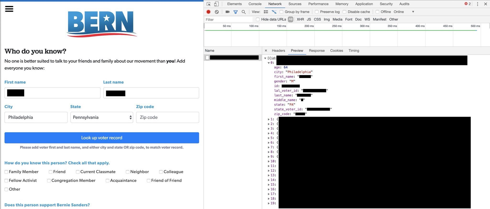
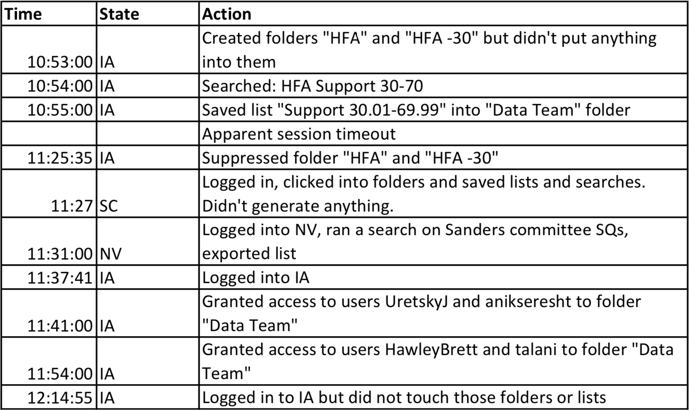
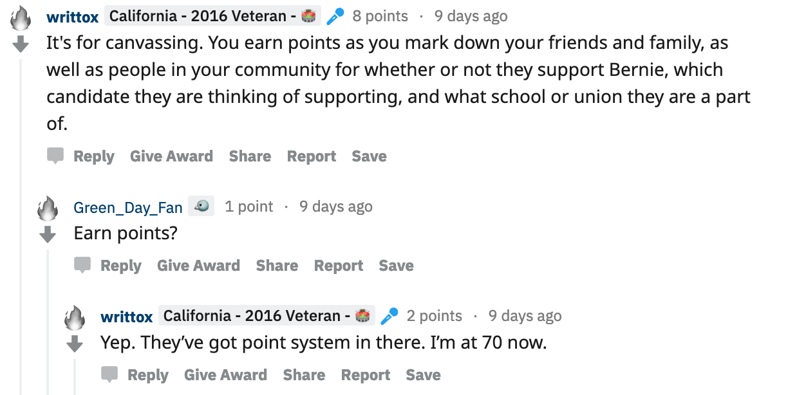

The team behind Bernie Sanders' 2020 campaign [released a new web app](https://www.nbcnews.com/politics/2020-election/bernie-sanders-2020-campaign-unveils-app-increase-its-voter-database-n999206) last month named [BERN](https://app.berniesanders.com/). The goal of BERN is simple: gather as much information as you can on as many voters in the United States as you can, and make Bernie's grassroots army of enthusiastic supporters do the work. It's undoubtedly a smart move, but also a concerning one for myself and other privacy advocates.

BERN has two features: one called "Friend-to-Friend" (described as "add everyone in your network") and another called "Community Canvassing" (described as "talk to people around you every day, e.g. on the bus, outside the grocery store, at a park"). Both of these involve phoning home to Sanders HQ with the following information on anybody you know or meet:

- Level of support for Bernie Sanders (from 1 to 7)
- How you know this person (family, neighbor, classmate, etc.)
- If they're a student (and specifically which college they attend)
- If they're a union member (and which union)
- Issues that are "most important" to them
- List of other candidates they might support
- Their phone number
- Their email address

But how do I know who I know, you might ask? BERN's [FAQ page](https://app.berniesanders.com/help/app-frequently-asked-questions/) helpfully answers this:

> **Brainstorm a list of your contacts.** Think about who you have come to know over the course of your life. How do you know who you know? On a piece of paper or in a spreadsheet, write down as many names of people you know. Some ideas for brainstorming:
>
> - Go through your phone book or, if you use Facebook, your Facebook friend list.
> - Who would you invite to your birthday party or wedding? Where have you lived throughout your life? Who did you know in each of the places you have lived?

> **Which people can I add to my contact list the BERN app?** *[sic]*
> We use the word “friend” very broadly: You can add anyone you have met and known in your life to the app. 

You start by searching for the voter you're (theoretically) talking to by entering his or her first name, last name, and location (which only requires entering the state but can be narrowed down by town and/or ZIP code). Every match pops up with each person's age, sex, and location along with an option to add the information of someone who's not listed or still needs to register to vote.

Here's one of the instructional videos provided internally to volunteers:



Defenders of the BERN app have pointed out that the information used is already available from public voter databases ran independently by each state. This is true. But these public records have never been tied to a campaign's internal voter files through a tool that's wide open to the entire internet, with incentives to add valuable data that benefits one candidate.

There were even unverified claims that [BERN was leaking voter ID numbers](https://info.idagent.com/blog/bern-app-exposes-150m-voter-records), which are the same as one's driver's license ID numbers in some states, through JSON responses in the first few days after its release. There don't be appear to be strict rate limits on calls to the API, either.

Others have noted that web-based organizing tools like BERN have been used by campaigns at all levels since President Obama's well-oiled, futuristic machine in 2007. This is also true, and I'm a big fan of the trend they started.

But the latter category of databases --- like [NationBuilder](https://nationbuilder.com/) and, more notably, [NGP VAN's VoteBuilder](https://act.ngpvan.com/votebuilder) software used by almost all Democratic campaigns across the United States --- are secured and strictly guarded. Volunteer accounts need to be created and approved by paid campaign organizers and are locked down to provide the bare minimum of information necessary for one to canvass or phone bank a shortlist of voters. Every single click is also recorded in a [detailed log](sanders-campaign-audit.pdf) down to the millisecond. (This is how [Bernie's organizers got busted](http://time.com/4155185/bernie-sanders-hillary-clinton-data/) snooping around Hillary's VoteBuilder data last cycle, by the way.)

BERN is taking this to a whole new level. Allowing anybody on the internet to sign up and add personal information to the campaign's database without approval is troubling, especially when you consider the gamified "points" system they've added as an incentive to report as much information on as many people as possible.

The [Privacy Policy link](https://berniesanders.com/privacy-policy/) at the bottom of the app links to a generic policy that looks like it's been copied from a default Wix website. There's no mention of the BERN app, no details of how they explicitly use this information, and no sign of an opt-out procedure.

Without getting too political --- everyone who knows me already knows [what I think of Bernie](https://jarv.is/notes/millenial-with-hillary-clinton/) --- it's hard to refute that his "bros" are [notorious for harassment](https://www.washingtonpost.com/news/the-fix/wp/2016/06/07/the-bernie-bros-are-out-in-full-force-harassing-female-reporters/?utm_term=.795f3a6a6ac9) and internet trolling. Giving them any information beyond their targets' Twitter handles is surely not going to help this time around.

Count me out of feeling the Bern and the BERN. Just regular old heartburn for me. 🤢

<!--  -->
