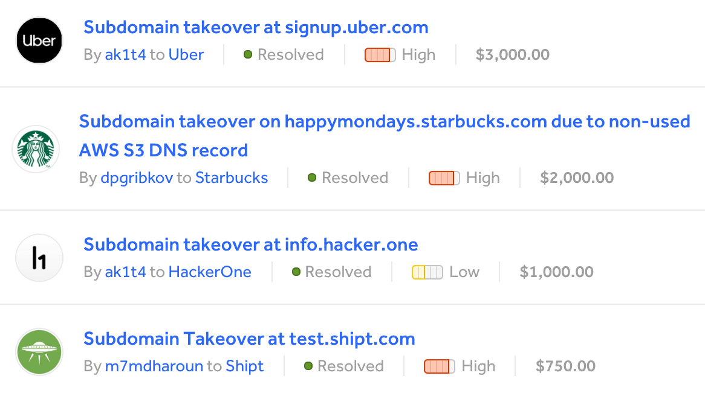

A **subdomain takeover** occurs when a subdomain (like *example*.jarv.is) points to a shared hosting account that is abandoned by its owner, leaving the endpoint available to claim for yourself.

Not only are takeovers a fun way to dip your toes into [penetration testing](https://www.cloudflare.com/learning/security/glossary/what-is-penetration-testing/), but they can also be incredibly lucrative thanks to [bug bounty programs](https://en.wikipedia.org/wiki/Bug_bounty_program) on services like [HackerOne](https://hackerone.com/hacktivity?order_direction=DESC&order_field=popular&filter=type%3Aall&querystring=subdomain%20takeover) and [Bugcrowd](https://bugcrowd.com/programs), where corporations pay pentesters for their discoveries.


*Huge rewards for subdomain takeovers on [HackerOne](https://hackerone.com/hacktivity?order_direction=DESC&order_field=popular&filter=type%3Aall&querystring=subdomain%20takeover)*

For a deep dive on the implications of takeovers, which can be a pretty serious vector of attack for malicious actors to obtain information from users of the targeted company, [Patrik Hudak](https://twitter.com/0xpatrik) wrote a [great post here](https://0xpatrik.com/subdomain-takeover/). Definitely take some time to skim through it and come back here when you're ready to hunt for a potential takeover yourself.

The most common services eligible for takeovers of abandoned subdomains are the following:

- Amazon S3
- ~~Amazon CloudFront~~ [(no longer vulnerable?)](https://github.com/EdOverflow/can-i-take-over-xyz/issues/29)
- Microsoft Azure
- Heroku
- GitHub Pages
- Fastly
- Pantheon.io
- Shopify
- Tumblr
- [...and many more.](https://github.com/EdOverflow/can-i-take-over-xyz#all-entries)

---

On [my GitHub profile](https://github.com/jakejarvis/), you'll find a Go-based tool named [`subtake`](https://github.com/jakejarvis/subtake) (based on [`subjack`](https://github.com/haccer/subjack)).

This tool takes a list of [CNAME records](https://support.dnsimple.com/articles/cname-record/) to check and outputs potential takeover candidates pointing to these services. But how in the world do we get a list of every CNAME on the internet?

Conveniently, [Rapid7](https://www.rapid7.com/) publishes a monthly list for us through their [Project Sonar](https://www.rapid7.com/research/project-sonar/) survey!

> [Project Sonar](https://opendata.rapid7.com/about/) is a security research project by Rapid7 that conducts internet-wide surveys across different services and protocols to gain insights into global exposure to common vulnerabilities. The data collected is available to the public in an effort to enable security research.

One of their free monthly datasets is called [Forward DNS](https://opendata.rapid7.com/sonar.fdns_v2/), where you'll find `.json` files named `xxxx-fdns_cname.json.gz`. Within the [`subtake`](https://github.com/jakejarvis/subtake) repository, there's an automated script named [`sonar.sh`](https://github.com/jakejarvis/subtake/blob/master/sonar.sh), which downloads the dataset for you and outputs a simple text file of CNAMEs pointed to any of the services listed above. Once you've [cloned the `subtake` repository](https://github.com/jakejarvis/subtake) and grabbed the timestamp part of the filename (the string that precedes `-fdns_cname.json.gz`), usage of the script is as follows:

```
./sonar.sh 2019-03-30-1553989414 sonar_output.txt
```

This new text file contains *both active and abandoned* subdomains pointing to any of the services listed above -- we still need to narrow it down to the takeover candidates by attempting to actually resolve each of them, which is where `subtake` comes into play. To install `subtake`, make sure [Go is installed first](https://golang.org/doc/install#install) and run the following:

```
go get github.com/jakejarvis/subtake
```

For a detailed description of the different options you can play around with, see the [full readme on GitHub](https://github.com/jakejarvis/subtake#usage) -- but here's a simple example command that uses 50 threads to take the CNAMEs listed in `sonar_output.txt` and outputs potentially vulnerable subdomains to `vulnerable.txt`.

```
subtake -f sonar_output.txt -c fingerprints.json -t 50 -ssl -a -o vulnerable.txt
```

This could take quite a while -- up to a day, depending on your CPU, memory, and bandwidth -- so I usually run it on a VM in the cloud and use [Linux's `screen` command](https://www.howtoforge.com/linux_screen) to keep it running and check in periodically. There will also be many unavoidable false positives that you'll need to check yourself by trying to claim the abandoned name on the corresponding service's portal, which is why I keep using the term *potential* takeovers. 

I also have a collection of root domains of companies offering bounties through [HackerOne](https://hackerone.com/directory/) or [Bugcrowd](https://bugcrowd.com/programs) at a [different GitHub repository](https://github.com/jakejarvis/bounty-domains/). Using the [`grep`-friendly text file](https://github.com/jakejarvis/bounty-domains/blob/master/grep.txt), it's easy to use [`grep`](http://man7.org/linux/man-pages/man1/grep.1.html) to narrow down your `vulnerable.txt` list even more:

```
grep -f grep.txt vulnerable.txt
```

---

In my view, takeovers are a fantastic way to begin a side hustle in bug bounties, simply due to the fact that once you've taken over a subdomain, you don't need to worry about another hunter beating you to the punch and reporting it before you.

Since you have this luxury of time, it becomes ***extremely important*** that you let your adrenaline subside and follow [responsible disclosure](https://www.bugcrowd.com/resource/what-is-responsible-disclosure/) guidelines -- especially in the creation of a "proof of concept" file with your username at an obscure location, **not** at `index.html`. I won't go over the details of writing a report because [Patrik Hudak](https://twitter.com/0xpatrik) wrote another [great post about it here](https://0xpatrik.com/takeover-proofs/). This is an example of one of my own reports (company name censored because it has not been publicly disclosed) on [Bugcrowd](https://bugcrowd.com/programs):


> I have found three subdomains of ********.com vulnerable to takeovers via unclaimed endpoints at [Azure's Traffic Manager](https://azure.microsoft.com/en-us/services/traffic-manager/). I have claimed these endpoints and redirected them to a blank page to prevent a bad actor from doing so in the meantime, and hosted a POC file at obscure URLs. These are the following domains I discovered and the outdated endpoints on Azure to which they point:

> xxxx.********.com --> aaa.trafficmanager.net

> yyyy.********.com --> bbb.trafficmanager.net

> zzzz.********.com --> ccc.trafficmanager.net

> ...and the proof-of-concept files are at the following locations:

> [http://xxxx.********.com/poc-d4ca9e8ceb.html](#)

> [http://yyyy.********.com/poc-d4ca9e8ceb.html](#)

> [http://zzzz.********.com/poc-d4ca9e8ceb.html](#)

> I have not hosted any other file nor attempted any other vector of attack. You're probably familiar with takeovers like this by now, but through this vulnerability, it would be possible for an attacker to obtain cookies and other sensitive information from your users via phishing, cookie hijacking, or XSS. It is also possible to obtain SSL certificates for ********.com subdomains from CAs that only require domain validation such as [Let's Encrypt](https://letsencrypt.org/how-it-works/), but I have not attempted to do so. More info on possible attack vectors [can be found here](https://0xpatrik.com/subdomain-takeover/).

> Please let me know when you've received this report and I'll delete the endpoints from my personal Azure account, so you can either reclaim them or remove the subdomains entirely from your DNS records. Thanks!


I removed the company's name because an important part of responsible *disclosure* is the *disclosure*, or lack thereof. Until the company explicitly gives permission to publicly disclose the vulnerability after patching it -- and there are built-in features on both HackerOne and Bugcrowd to request this -- it's **not okay** to talk about it publicly.

The `poc-d4ca9e8ceb.html` proof-of-concept file contained this single, hidden line:

```html
<!-- subdomain takeover POC by @jakejarvis on Bugcrowd -->
```

No self-promotional links or redirects, no examples of XSS/cookie hijacking to be "helpful" (no matter how harmless), no funny business of any kind.

---

I have several more [improvements](https://github.com/jakejarvis/subtake#to-do) I want to make to `subtake` (like integrating the `sonar.sh` script into the main Go executable, polishing the [all-in-one automated Docker image](https://hub.docker.com/r/jakejarvis/subtake), a self-updating list of service fingerprints, etc.) but still feel free to [make a suggestion](https://github.com/jakejarvis/subtake/issues) and/or contribute to the repository in the meantime.

Happy hunting, fellow penetrators! 😉