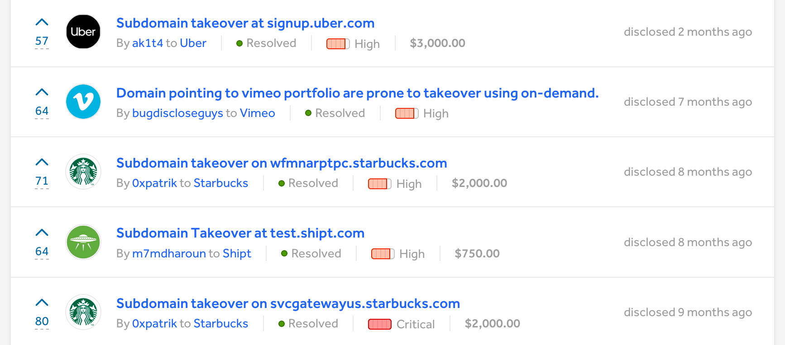

A **subdomain takeover** occurs when a subdomain (like *example*.jarv.is) points to a shared hosting service that is abandoned by its owner, leaving the account available to claim for yourself.

Not only are takeovers a fun way to dip your toes into [penetration testing](https://www.cloudflare.com/learning/security/glossary/what-is-penetration-testing/), but they can also be incredibly lucrative thanks to [bug bounty programs](https://en.wikipedia.org/wiki/Bug_bounty_program) on services like [HackerOne](https://hackerone.com/hacktivity?order_direction=DESC&order_field=popular&filter=type%3Aall&querystring=subdomain%20takeover) and [Bugcrowd](https://bugcrowd.com/programs), where corporations pay pentesters for their discoveries.


*Huge rewards for subdomain takeovers on [HackerOne](https://hackerone.com/hacktivity?order_direction=DESC&order_field=popular&filter=type%3Aall&querystring=subdomain%20takeover)*

For a deep dive on the implications of takeovers, which can be a pretty serious vector of attack for malicious actors to obtain information from users of the targeted company, [Patrik Hudak](https://twitter.com/0xpatrik) wrote a [great post here](https://0xpatrik.com/subdomain-takeover/). Definitely take some time to skim through it and come back here when you're ready to hunt for a potential takeover yourself.

The most common services eligible for takeovers of abandoned subdomains are the following:

- Amazon S3
- ~~Amazon CloudFront~~ [(no longer vulnerable?)](https://github.com/EdOverflow/can-i-take-over-xyz/issues/29)
- Microsoft Azure
- Heroku
- GitHub Pages
- Fastly
- Pantheon.io
- Shopify
- Tumblr
- [...and many more.](https://github.com/EdOverflow/can-i-take-over-xyz#all-entries)

On [my GitHub profile](https://github.com/jakejarvis/), you'll find a Go-based tool named [`subtake`](https://github.com/jakejarvis/subtake) (based on [`subjack`](https://github.com/haccer/subjack)).

This tool takes a list of [CNAME records](https://support.dnsimple.com/articles/cname-record/) to check and outputs potential takeover candidates pointing to these services. But how in the world do we get a list of every CNAME on the internet?

Conveniently, [Rapid7](https://www.rapid7.com/) publishes a monthly list for us through their [Project Sonar](https://www.rapid7.com/research/project-sonar/) survey!

> [Project Sonar](https://opendata.rapid7.com/about/) is a security research project by Rapid7 that conducts internet-wide surveys across different services and protocols to gain insights into global exposure to common vulnerabilities. The data collected is available to the public in an effort to enable security research.

One of their free monthly datasets is called [Forward DNS](https://opendata.rapid7.com/sonar.fdns_v2/), where you'll find `.json` files named `xxxx-fdns_cname.json.gz`. Within the [`subtake`](https://github.com/jakejarvis/subtake) repository, there's an automated script named [`sonar.sh`](https://github.com/jakejarvis/subtake/blob/master/sonar.sh), which downloads the dataset for you and outputs a simple text file of CNAMEs pointed to any of the services listed above. Once you've [cloned the `subtake` repository](https://github.com/jakejarvis/subtake) and grabbed the full name of the most recent `fdns_cname.json.gz` file, usage of the script is as follows:

```
./sonar.sh 2019-03-30-1553989414-fdns_cname.json.gz all_cnames.txt
```

This new text file contains *both active and abandoned* subdomains -- we still need to narrow it down to the takeover candidates, which is where `subtake` comes into play. To install `subtake`, make sure [Go is installed first](https://golang.org/doc/install#install) and run the following:

```
go get github.com/jakejarvis/subtake
```

For a detailed description of the different options you can play around with, see the [full readme on GitHub](https://github.com/jakejarvis/subtake#usage) -- but here's a simple example command that uses 50 threads to take the CNAMEs listed in `all_cnames.txt` and outputs potentially vulnerable subdomains to `vulnerable.txt`.

```
subtake -f all_cnames.txt -t 50 -ssl -a -o vulnerable.txt
```

This could take quite a while -- up to a day, depending on your CPU and bandwidth -- so I usually run it on a VM in the cloud and use [Linux's `screen` command](https://www.howtoforge.com/linux_screen) to keep it running and check in periodically. There will also be many unavoidable false positives that you'll need to check yourself by trying to claim the abandoned name on the corresponding service's portal, which is why I keep using the term *potential* takeovers. 

I also have a collection of root domains of companies offering bounties through [HackerOne](https://hackerone.com/directory/) or [Bugcrowd](https://bugcrowd.com/programs) at a [different GitHub repository](https://github.com/jakejarvis/bounty-domains/). Using the [`grep`-friendly text file](https://github.com/jakejarvis/bounty-domains/blob/master/grep.txt), it's easy to use [`grep`](http://man7.org/linux/man-pages/man1/grep.1.html) to narrow down your `vulnerable.txt` list even more:

```
grep -f grep.txt vulnerable.txt
```

---

In my view, takeovers are a fantastic way to begin a side hustle in bug bounties, simply due to the fact that once you've taken over a subdomain, you don't need to worry about another hunter beating you to the punch and reporting it before you.

Since you have this luxury of time, it becomes ***extremely important*** that you let your adrenaline subside and follow [responsible disclosure](https://www.bugcrowd.com/resource/what-is-responsible-disclosure/) guidelines -- especially in the creation of a "proof of concept" file with your username at an obscure location, **not** at `index.html`. I won't go over the details of writing a report because [Patrik Hudak](https://twitter.com/0xpatrik) wrote another [great post about it here](https://0xpatrik.com/takeover-proofs/).

---

I have several more [improvements](https://github.com/jakejarvis/subtake) I want to make to `subtake`, but still feel free to [make a suggestion](https://github.com/jakejarvis/subtake/issues) and/or contribute to it in the meantime.

Happy hunting, fellow penetrators! 😉