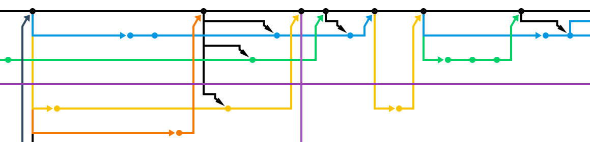
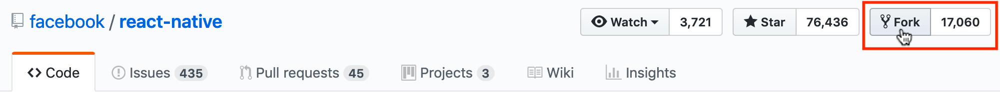
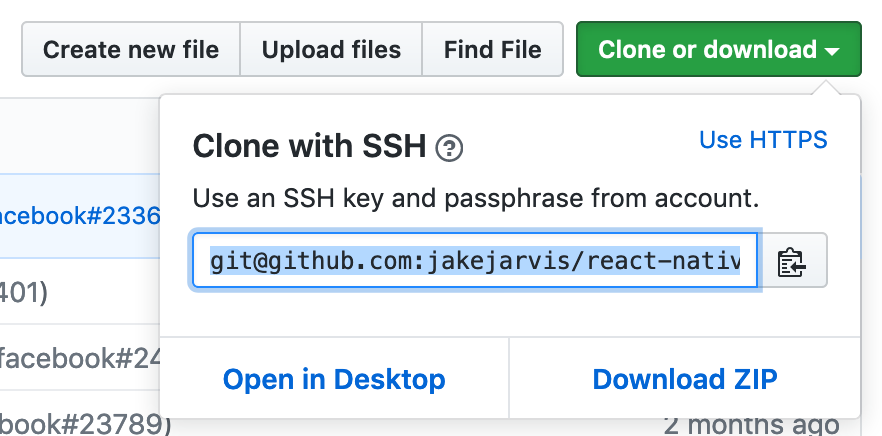
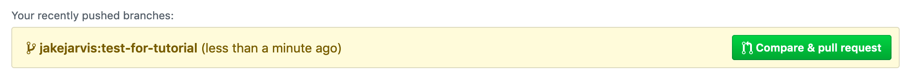

Contributing to an open-source project can be intimidating at first. The convoluted process of submitting your improvements for approval via a [**pull request**](https://help.github.com/en/articles/about-pull-requests) certainly doesn't help.

The following steps to submit a pull request will work on Git repositories hosted anywhere --- on [GitLab](https://gitlab.com/), [Bitbucket](https://bitbucket.org/), [Azure DevOps](https://azure.microsoft.com/en-us/services/devops/repos/), etc. --- but most open-source repositories one would want to contribute to are likely on [**GitHub**](https://github.com/), which is what we'll be using.

Starting from the very beginning, we'll fork an existing repository to our account, clone the fork locally, commit your changes to a new branch, and push it back upstream to GitHub to submit for approval.

---

## 1. Forking the Repository

Assuming you're using GitHub, this step is easy. Just find the repository you're contributing to and press the Fork button in the upper left. This will create an exact copy of the repository (and all of its branches) under your own username.




## 2. Clone your new fork locally

GitHub will automatically redirect you to the forked repository under your username. This is the repository you need to clone to your local development environment, **not** the original. Grab the URL GitHub provides under the green "Clone or Download" button and plug it into the command below.

```
git clone git@github.com:jakejarvis/react-native.git
```




## 3. Track the original repository as a remote of the fork

Once you've forked a repository, changes to the original (or "upstream") repository are not pushed to your fork. We need to tell the new repository to follow changes made upstream to keep it fresh via [something called a `remote`](https://git-scm.com/book/en/v2/Git-Basics-Working-with-Remotes).

Switch directories to the forked repository you just cloned and run the following commands. Replace the last part of the first line with the **original** repository clone URL --- similar to the how you grabbed the URL in step 2, but this **isn't** the one with your username.

This links the fork back to the original repository as a remote, which we'll name `upstream`, and then fetch it.

```
git remote add --track master upstream git@github.com:facebook/react-native.git
git fetch upstream
```


## 4. Create a new branch for your changes

It's possible to make changes directly to the `master` branch, but this might FUBAR things down the road for complicated reasons. It's best to [`checkout`](https://git-scm.com/docs/git-checkout) a new branch for **each** change/improvement you want to make. Replace `fix-readme-typo` with a more descriptive name for your changes, like `add-mobile-site` or `update-dependencies`.

```
git checkout -b fix-readme-typo upstream/master
```


## 5. Make your changes!

This is either the easiest part or the hardest part, depending on how you look at it. 😉 At this point, you're isolated in the new branch you just created, and it's safe to open whatever text editor or IDE you use and go wild.


## 6. Add, commit, and push the changes

You're probably used to these commands. Add the files you've changed and commit them with a descriptive message.

```
git add .
git commit -m "Fix grammar mistakes in the readme file"
```

The one difference is the branch you're pushing to. You likely usually push to `master`, but in this case, we're pushing to the branch with the name you created in step 4.

```
git push -u origin fix-readme-typo
```


## 7. Submit your pull request

You're now all ready to submit the improvement you've made to the project's maintainers for approval. Head over to the original repositories Pull Requests tab, and you should see an automatic suggestion from GitHub to create a pull request from your new branch.




---

I'll admit, I need to refer back to these notes whenever I'm preparing to contribute to an open-source project. It's certainly not the most intuitive process, but at least it's the same wherever the project is located --- for example, I host my [own private GitLab CE instance](https://git.jarv.is/jake). The universality of Git is what makes it great! 👍
