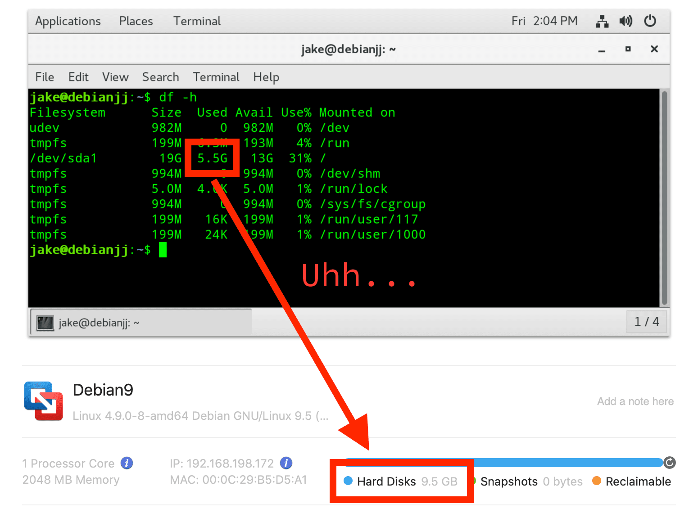
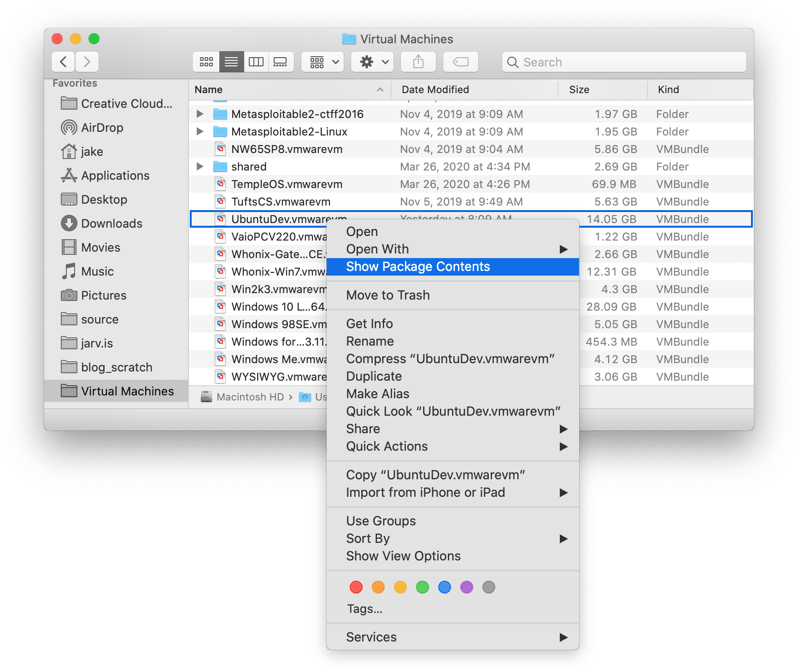

**[VMware Workstation](https://www.vmware.com/products/workstation-pro.html)** and **[Fusion](https://www.vmware.com/products/fusion.html)** normally work hard to minimize the size of virtual hard disks for optimizing the amount of storage needed on your host machine . On Windows virtual machines, [VMware has a “clean up” function](https://docs.vmware.com/en/VMware-Fusion/11/com.vmware.fusion.using.doc/GUID-6BB29187-F47F-41D1-AD92-1754036DACD9.html), which detects newly unused space and makes the size of the virtual hard disk smaller accordingly. You’ll notice that even if you create a virtual machine with a capacity of 60 GB, for example, the actual size of the VMDK file will dynamically resize to fit the usage of the guest operating system. 60 GB is simply the maximum amount of storage allowed; if your guest operating system and its files amount to 20 GB, the VMDK file will simply be 20 GB.

VMware can be set to automatically optimize and shrink virtual hard disks as you add and, more importantly, remove files – but [this automatic "clean up" setting is disabled by default](https://docs.vmware.com/en/VMware-Fusion/11/com.vmware.fusion.using.doc/GUID-6BB29187-F47F-41D1-AD92-1754036DACD9.html). Either way, cleaning up virtual machines works like a charm...when you have Windows as a guest operating system with an NTFS disk.

As a developer, I have several VMs with various Linux-based guest OSes – and, for some reason, VMware doesn't know how to optimize these. If you poke around in VMware, you'll find that the clean up button is greyed-out under the settings of a Linux VM.

Commonly, I'll use a few gigabytes of storage for a project and then delete the files from the guest when I'm done. Let's say that my Debian guest starts at 10 GB and I use 5 GB for my project, totaling 15 GB. The VMDK file will be, obviously, 15 GB. I finish the project and delete the 5 GB of its files. On a Windows guest, VMware would be able to shrink the volume back down to 10 GB – but you'll quickly notice, annoyingly, that a Linux disk will remain at 15 GB, even though you're no longer using that much. On a portable machine like my MacBook Air, this can be a _huge_ waste!

The "clean up" feature that VMware has developed for Windows guests can be applied to Linux guests as well, but it's pretty convoluted – we need to essentially clean up the VM ourselves, trick VMware to detect the free space, and manually shrink the volume.

**_A tiny caveat:_** This only works on VMs without any snapshots. Sadly, you either need to delete them or, if you care about keeping snapshots, you can backup the VM as-is to an external disk and then delete the local snapshots.

Once you're ready, here's how to shrink your Linux-based VM:

## **Step 1:** Clean up time

Boot up your Linux virtual machine. We'll start by optimizing the OS as much as possible before shrinking it. In addition to manually deleting files you no longer use, running this command in your terminal can free up a little more space by removing some installation caches left behind by old versions of software you've installed and updated:

    sudo apt-get clean

## **Step 2:** Make "empty" space actually empty

This step is the crucial one. In order for VMware to detect the newly free space, we need to free it up ourselves using a little trickery. We're going to have Linux overwrite the free space with a file full of zeros – the size of this file will be the size of however much space we're freeing up (5 GB, in the example above) – and then delete it. These commands will create the file, wait a moment, and then delete the file:

    cat /dev/zero > zero.fill
    sync
    sleep 1
    sync
    rm -f zero.fill

Depending on how much space we're freeing, this could take a while. Let it finish or else you'll be left with an actual, real file that will occupy a ton of space – the opposite of what we're trying to accomplish!

## **Step 3:** Letting VMware know we've done its dirty work

The final step is to tell VMware we've done this, and manually trigger the clean up function that works so well on Windows VMs. You'll do this step **outside** of the virtual machine, so shut it down fully and exit VMware. These directions are for macOS hosts specifically – if you're on a Linux host, I'll assume you are able to find the VMDK file, but [here's some help if you need](https://www.howtogeek.com/112674/how-to-find-files-and-folders-in-linux-using-the-command-line/).

VMware on macOS makes this a little tricky, since it packages VMs in what looks like a ".vmwarevm" file, which is actually a folder. Browse to wherever you've saved your virtual machines, probably somewhere in your home folder, and find the location of this ".vmwarevm" androgynous item. If you click on this folder, though, it'll just open VMware again.

We need to right click on the .vmwarevm "file," and select **Show Package Contents** to see what's really in there. You should see the actual .VMDK file sitting there – normally we're looking for the plain VMDK file (named _Virtual Disk.vmdk_ by default) without a bunch of numbers after it, but if you have snapshots associated with your VM, this might not be the file we actually want. But run the command below with it anyways, and the output will tell you if you need to use a different file.

Now, we're going to run our final command in our **host** terminal, so open that up. Linux installations of VMware Workstation should have a simple map to the _vmware-vdiskmanager_ utility that you can run anywhere, but on macOS we need to tell it exactly where that's located: in the Applications folder, where Fusion is installed.

We're going to feed this command the exact location of the VMDK file we're shrinking. You can either do this by typing the **full path** to it, or by simply dragging the VMDK file onto the terminal after typing the first part of the command (up to and including "-d"). The "-d" argument will defragment the disk.

    /Applications/VMware\ Fusion.app/Contents/Library/vmware-vdiskmanager -d <path to your .VMDK file>

The final command should look something like this, with your VMDK file instead:

    /Applications/VMware\ Fusion.app/Contents/Library/vmware-vdiskmanager -d /Users/jake/Documents/Virtual\ Machines/Debian9.vmwarevm/Virtual\ Disk.vmdk

If you've done this correctly, you'll see it defragmenting the file, and then return "Defragmentation completed successfully." If it returns a different error, such as "This disk is read-only in the snapshot chain," it should tell you which disk you should actually shrink. Just run the command again with that VMDK file instead.

After the defragmentation completes, we need to finally shrink the image. We do this by running the same command as you did above, but replacing the "-d" with "-k" as follows:

    /Applications/VMware\ Fusion.app/Contents/Library/vmware-vdiskmanager -k <path to the same .VMDK file>

## **Step 4:** Storage Profit!

Obviously, this is a really annoying way to perform a feature that only takes one click to execute on Windows virtual machines. I don't recommend going through this entire process every time you delete a few random files. However, if you notice the free space on your host OS is mysteriously lower than it should be, the time this takes can be well worth it.

Let's hope this will be integrated in VMware Tools in the near future – feel free to [nudge VMware about it](https://my.vmware.com/group/vmware/get-help?p_p_id=getHelp_WAR_itsupport&p_p_lifecycle=0&_getHelp_WAR_itsupport_execution=e1s2) in the meantime!

* * *

### Update (Dec. 30, 2018):

The open-source version of VMware Tools for Linux, [open-vm-tools](https://github.com/vmware/open-vm-tools), has added a simple command to automate the above steps in the latest version. Make sure you have the latest update through either apt or yum, and then run the following command in the **guest** terminal:

    vmware-toolbox-cmd disk shrink /

Thank you to [commenter Susanna](https://jake.wordpress.com/2018/12/04/how-to-shrink-linux-virtual-disk-vmware/#comment-21) for pointing this out!
