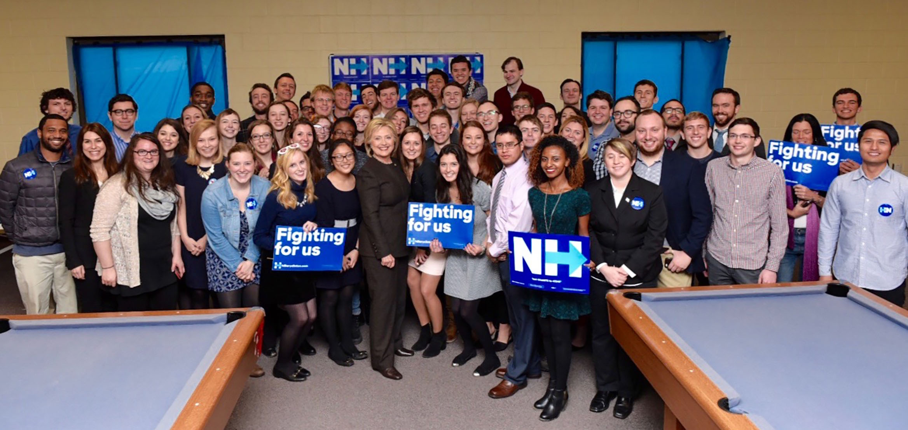
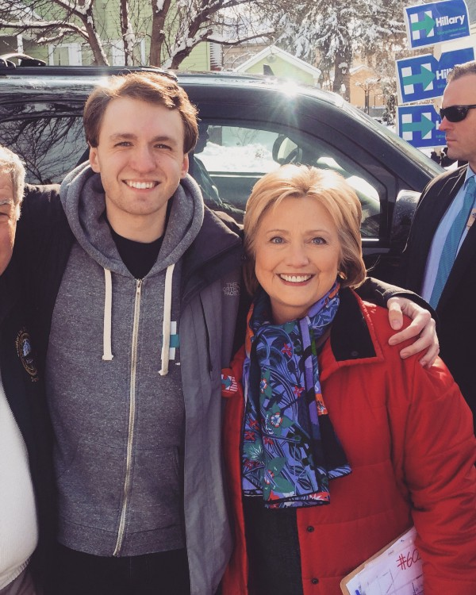

*[Hillary for New Hampshire](https://twitter.com/hillaryfornh) Winter Fellows with [Hillary Clinton](https://www.hillaryclinton.com/) in Derry, NH ([February 3, 2016](https://www.flickr.com/photos/hillaryclinton/24707394571/))*

## Keeping in mind the big picture…

I am a 24-year-old “millennial” and I passionately support [Hillary Clinton](https://www.hillaryclinton.com/) for the 45th President of the United States. Yes, we exist.

My goal here isn’t to convince every Bernie believer to jump ship and support her as passionately as I do, although I feel obligated to try. I totally understand the passion for Bernie. I smile inside every time I see a young person (like my sister) become interested in politics for the first time and become directly involved in influencing the course of their own future, no matter which candidate triggered it for them. For me, it was admittedly Senator Obama. I would, however, like to put the Democratic Party primary process back into perspective, because it’s turned into a bloodsport that isn’t helpful for _anybody_ in the long run — not for either candidate, not for our party, and certainly not for our country.

**News Flash:** We aren’t in the general election right now. Not even close. We’re in the middle of _our own party’s_ primary, where the field of opponents we are choosing from are all our friends. They’re both on our side. They both agree on an overall vision for our country. Of course as individuals we choose one who we like better than the other, and root for her or him and ideally invest some time and money to help however we can. I chose Hillary a long time ago because I feel she is, if anything, overqualified for the position. Especially during this increasingly turbulent period of foreign affairs, we can’t afford to allow an entry-level applicant to experiment with our standing in the world and learn our relationships with other nations on-the-fly.

After working for months as a fellow on Hillary’s campaign in New Hampshire leading up to the first primary in the country, I could feed you all the standard campaign talking points in my sleep: After graduating from Yale Law she went to work at the [Children’s Defense Fund](http://www.childrensdefense.org/), not a high-paying New York law firm. She [went undercover](http://www.nytimes.com/2015/12/28/us/politics/how-hillary-clinton-went-undercover-to-examine-race-in-education.html?_r=0) in Alabama to investigate discrimination in public schools. She [got juveniles out of adult prisons](http://www.huffingtonpost.com/entry/huffpost-criminal-justice-survey-democratics_us_56bb85eae4b0b40245c5038b). She [gave 8 million children healthcare](https://www.hillaryclinton.com/briefing/factsheets/2015/12/23/hillary-clintons-lifelong-fight-for-quality-affordable-health-care-for-all-americans/). But there’s just one thing that, for some reason, is hard for people to believe: at her core she is a good, caring, and loving person who has had only selfless intentions her entire life. I promise you.

I had the incredible chance to meet Hillary the weekend before the New Hampshire primary. Her motorcade plowed through a quiet suburb in Manchester around noon and she hopped out to go knock on the doors of some lucky families. As neighbors started coming out of their houses to shake her hand, I couldn’t restrain myself from at least trying to get close and wave hello. (By the way, it’s amazing how casual the people in New Hampshire are about meeting presidential candidates.)

I walked up nervously and told her that it was my birthday (it was) and all I wanted was for her to win, which got her attention, and I thanked her for the spotlight she had been shining on the rampant addiction epidemic in the state. Instead of nodding her head and thanking me for my support and moving along like I assumed she would — she knew she would have my vote no matter what — she locked eyes with me and asked me how I’d been affected by the issue. It felt as though she dropped everything in her life and literally put her jam-packed schedule on pause to make sure I was okay and to learn more about some dude she just met ten seconds ago. I told her that I had fallen into the trap myself when I was younger, and that the [part of her detailed plan](https://www.hillaryclinton.com/issues/addiction/) that addresses the overprescription of narcotics by doctors could have prevented me from doing so. As my conversation with her grew longer and longer, and as she respectfully asked me more and more questions about my story, I totally forgot I was casually chatting on the sidewalk with a freaking former First Lady, Senator, and Secretary of State. I promise you again: She. Is. A. Real. Person.

> “I know I have some work to do, particularly with young people, but I will repeat again what I have said this week. Even if they are not supporting me now, I support them.” [»](http://www.vox.com/2016/2/9/10956458/hillary-clinton-new-hampshire)

But at the end of the day, all I ask is for you to keep in mind the stakes in this overall election. They have never been higher. Last year, the spectacle of Donald “The Donald” Trump running to be the leader of the free world was purely comical and impossible not to laugh at, from the moment he entered the race [via gold-plated escalator](https://www.youtube.com/watch?v=Ab9AnZaLL1U) whilst blasting Neil Young. But as this racist xenophobic pumpkin is rapidly racking up _actual real-life delegates_ thanks to votes from the [poorly educated](http://www.vox.com/2016/2/24/11107788/donald-trump-poorly-educated) and/or the [white supremacists](http://www.huffingtonpost.com/entry/donald-trump-white-supremacist-sec-primary_us_56cf4437e4b0bf0dab31222f), the thought of him being within striking distance of the desk in the Oval Office is slowly twisting a knife into the pit of my stomach. This is real. This is the big picture. This is why we need to team up and work together in any way possible as soon as possible.

I’m aware of the street cred young Democrats collect by claiming they hated Hillary before hating Hillary was cool. Hating on HRC has gone more viral than Damn Daniel. But when you ask these young voters to explain why they think she’s a liar or untrustworthy or a criminal, they can rarely put their distaste for her into actual words — or if they do, they just vomit hashtag-ready soundbites from Fox News or The Young Turks. #Benghazi. #Emails. #ReleaseTheTranscripts. Joining in on the Republican-led attacks and stooping to their level is no way to advocate for the candidate you support. If you support Bernie for the nomination, you do that by going out and talking to others about why **his** policies rock, what **his** life story is, how **your** story relates to **his** story and **his** policies, etc. — not by spending your day mercilessly assassinating the character of a woman you’ve never met and a woman you might very well be voting for in eight short months, unless you’re able to stomach the idea of President Trump. During primary season, you win by focusing on the merits of your own candidate, not the flaws you see in another.

As [Bill Maher](https://medium.com/u/cdc04a9799f6) (an avid Bernie supporter) [said this weekend](https://www.youtube.com/watch?v=rd1gpjkjcfc), some in our party need to “learn the difference between an imperfect friend and a deadly enemy.” I don’t agree with everything Hillary has said or done. I don’t unconditionally defend every single chapter in her public record over the past 30 years (and [neither does she](https://www.washingtonpost.com/blogs/post-partisan/wp/2016/02/25/hillary-clinton-responds-to-activist-who-demanded-apology-for-superpredator-remarks/), by the way). I don’t think that’s possible for any voter to find in a politician. But if you identify as a Democrat, she is the farthest thing from your enemy. Plain and simple. Like you and Bernie, she wants to prevent a Republican from winning in November and reversing so much of the progress we’ve made over the past seven years on their first day in office. That is our number one goal right now. And whether it gets accomplished by a President Clinton or a President Sanders, I am 100% on board either way. Let’s stop fighting each other and start fighting together.

