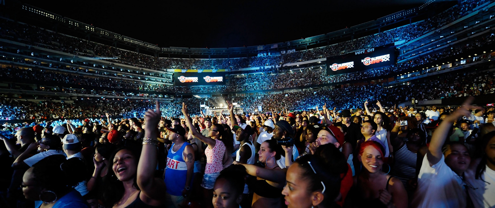
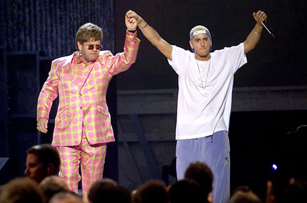
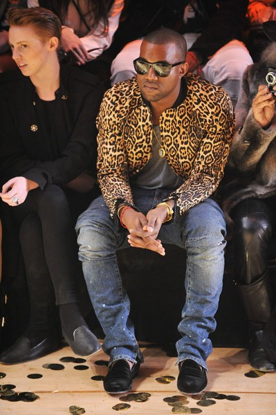
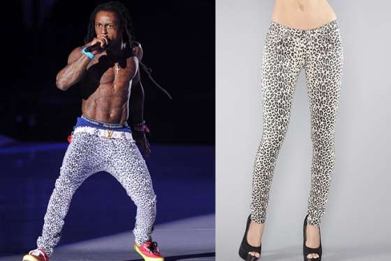
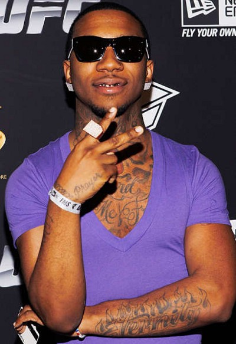

*This essay was written for Professor [David Valdes-Greenwood](https://www.davidvaldesgreenwood.com/)’s "Love & Sexuality" class at [Tufts University](https://www.tufts.edu/) in April 2012.*

* * *

> Too many faggot n*ggas clocking my spending, exercising your gay-like minds like Richard Simmons …. Fucking faggot-ass light skin n*ggas, get the fuck out of my face …. It’s crazy how you can go from being Joe Blow, to everybody on your dick, no homo …. You homo n*ggas getting AIDS in the ass, while the homie here’s trying to get paid in advance …. If y’all leave me alone this wouldn’t be my M.O., I wouldn’t have to go, ‘eenee-meene-minie-moe,’ catch a homo by his toe, man I don’t know no more...

What do all of these lyrics have in common? Two things. Firstly, they are all blatant in their use of anti-gay slurs and graphically homophobic language. And secondly, they’ve each been written and recorded by one of the top five mainstream rap artists of 2011: Jay-Z, Diddy, Kanye West, Lil Wayne, and Eminem — a worshipped all-star team in music with a combined income of $82 million last year alone, with multi-platinum records endorsed by and distributed through Universal, Sony, and Warner Brothers, and with endorsement deals from Gatorade, HP, Pepsi, Chrysler, Lipton, and others.

Of course, these five rappers are protected by their right to free speech to speak these irrefutably homophobic lyrics into a studio microphone, release them onto future multi-platinum CDs, and get played by world-renowned New York City radio stations. But what about their gay and bisexual counterparts? A fame-aspiring gay rapper has just as much of a right, if not more, to record music as Jay-Z and Eminem record, and as much of a right to speak publicly as Ellen DeGeneres and Rosie O’Donnell speak. So, to put it candidly, where are all the gay rappers? I’ll give you a minute to scroll through your iPod.

Is the increasingly apparent void of gay (or even bi) male rappers due to a lack of demand or a lack of supply? Or, do gay rappers get automatically turned away at the doors of Universal, Sony, and Warner Brothers, over fears of losing profit? Let’s follow a hypothetical gay rapper through the intricacies and politics of the music industry to answer one simple, overarching economical question: How successful would a young, talented, and coincidentally gay male rapper be in 2012?

To get a sense of the industry a new gay rapper would be walking into, I surveyed 62 college-aged rap fans at Tufts University. Before introducing the prospect of a gay rapper to them, I wanted to gauge their feelings about the homophobia in pre-existing mainstream rap music. The results were staggering: 92% of the respondents said that hearing “faggot” or “no homo” doesn’t stand out to them while listening to a song, and 100% wouldn’t stop listening to that song or that artist after hearing these phrases. On the flip side, none of the 62 respondents–including one gay sophomore–could name a gay rapper. The existing landscape of the rap industry became rapidly clear: there are no gays on the radar, except when “homo” or “fag” rhymes with the line before it.

My next inquiry was about whether there’s room for a gay person in the mainstream rap industry. Is the clear absence of gay voices from mainstream rap by the choice of gay rappers, or is there no demand from music listeners? 90% of the college respondents claimed that they would listen to a gay rapper (under the condition that he or she is talented, of course). However, only 4% could reasonably predict that a talented gay rapper would be commercially successful. When asked to explain, the responses included that “the ridicule and internal conflict [would not be] worth the possible profit for record labels,” that “people would be embarrassed to have their iPod seen with the rapper’s name playing,” and that “rap is already about women, women, and women, and it’s been around for too long to change that.”

It became apparent to me that there is still an ethical divide between the rap industry and the rest of America. In 2012, there are few areas where undisguised and unapologetic homophobia is not only accepted, but rewarded with money and power. (Rap and the Republican presidential nomination race come to mind.) Every few years, we see the issue of rap and homophobia as front-page news, but the time between these climaxes of public outrage is filled with self-encouraging homophobic songs that get no backlash at all.

*Frank Micelotta/Getty Images*

Eminem is a prime example of this. After rapping about “homos” and “fags” for years, his third studio album, _The Marshall Mathers LP_, finally saw mainstream recognition and acclaim, including the nomination for Best Rap Album and Album of the Year at the 2001 Grammy Awards. After both the National Academy of Recording Arts & Sciences and CBS “endured a storm of protest over the rapper’s best album nomination” due to his use of homophobic slurs, Eminem announced a duet with Elton John to be performed at the Grammy ceremony. “I’d rather tear down walls between people than build them up. If I thought for one minute that he was hateful, I wouldn’t do it,” John said in defense of the performance.

However, the newly announced alliance was still met with criticism from the Gay & Lesbian Alliance Against Defamation, or GLAAD. Media director Scott Seomin called the move “hurtful” and “embarrassing,” and voiced public regret for giving John the foundation’s yearly award the year before, claiming, “Elton’s actions now totally violate the spirit of that award.”

More recently, in late 2011, MTV’s Video Music Awards also came under fire from GLAAD for recognizing the sophomore album from 20-year-old rapper Tyler, The Creator. According to _NME Magazine_, the album from Tyler, The Creator and his group, Odd Future, “uses the word ‘faggot’ and its variants a total of 213 times.” In defense of his lyrics, Tyler told NME:

> I have gay fans and they don’t really take it offensive, so I don’t know. If it offends you, it offends you. I’m not homophobic. I just think ‘faggot’ hits and hurts people. It hits. And ‘gay’ just means you’re stupid. I don’t know, we don’t think about it, we’re just kids. We don’t think about that shit. But I don’t hate gay people. I don’t want anyone to think I’m homophobic.

The seemingly clear disconnect between rap and the rest of America becomes somewhat blurred when you factor in that the award Tyler, The Creator won was determined by a popular vote of MTV’s fairly young audience. Sara Quin, 20-year-old Canadian indie singer and half of the rock duo Tegan and Sara, expressed her frustration with both Tyler and the music industry on her blog. “While an artist who can barely get a sentence fragment out without using homophobic slurs is celebrated on the cover of every magazine, blog and newspaper,” she wrote, “I’m disheartened that any self-respecting human being could stand in support with a message so vile.” Tyler simply responded with, “If Tegan and Sara need some hard dick, hit me up!”

With both homophobia and “womanizing” being so prevalent in the mainstream rap industry, one has to wonder if these themes are not only accepted, but also necessary to become a successful rapper. When the top five rappers of 2011 openly use homophobic slurs in _Billboard_ Top 100 songs, is homophobia in rap simply a vicious cycle of new rappers trying to climb the ladder to work with these acclaimed rappers by using similar lyrics and style? Are rappers simply afraid to “come out” as non-homophobic in fears that this will sever ties to more successful rappers which are necessary in an industry full of connections and word-of-mouth?

According to mainstream rapper and insider Fat Joe, this fear is very much real. But as of 2011, he says, there’s no reason for a rapper to hide his sexuality. In an interview with _Vibe Magazine_, Joe speculated, “I’m pretty sure I’ve done songs with gay rappers…In 2011 you gotta hide that you gay? Like, be real. ‘Yo, I’m gay, what the fuck!’ Fuck it if people don’t like it.”

Based on his inside experience, Joe continued to claim that a gay rapper would have an outpouring of support from inside even the mainstream rap industry, even going as far as calling the entertainment industry a “gay mafia,” including everyone from “editorial presidents of magazines, PDs at radio stations, and the people that give you awards at award shows. This is a fucking gay mafia, my man; they are in power.”

Similarly, a few months before Fat Joe came out publicly favoring gay rappers, Grammy-nominated rapper The Game spoke out less strongly but still in support of the idea. In an interview with DJ Vlad, Game told gay rappers:

> I think there are several rappers that are in the closet and gay, and see those are the type of gay people—the only type of gay people that I have a problem with. I don’t have a problem with gay people. Game don’t have a problem with gay people. It ain’t cool to be in the closet. If you gay, just say you gay. Be gay and be proud.

A year earlier, in 2009, Queens rapper N.O.R.E. also revealed to DJ Vlad:

> I have recorded, not with people who are openly gay, but people who are closet gays. I’ve got songs, you know, Google it. I’m positive I have worked with a gay rapper. There is one and he won’t get me to say the name. Once he’s a success story to the point where he can’t be stopped, then yeah, he’s gonna come out the closet… It’s not a big secret, everybody is gonna be like, “Oh yeah, I knew that.”

Several other rappers have recently been vocal against homophobia. Nicki Minaj, protégé of Lil Wayne, said in an interview last year with _Out Magazine_, “Normally, Wayne probably wouldn’t have gay guys coming to see his shows much, but they’re definitely a big part of my movement, and I hope they’d still come out and see me. I think that will be really, really interesting, just to start bridging that gap.” Up-and-coming 23-year-old rapper A$AP Rocky, admitted last year to Pitchfork.com, “I used to be homophobic, but that’s fucked up. I had to look in the mirror and say, ‘All the designers I’m wearing are gay.’”

*Sarah Taylor/Fashion Magazine*

Unfortunately, not all rappers—including and especially the most popular and celebrated—are not as enlightened as today’s up-and-comers such as Nicki Minaj and A$AP Rocky. Kanye West, one of the rappers quoted before for shouting “no homo” on Jay-Z’s number-one single _Run This Town_ and (in)famous for speaking what’s on his mind, was the target of countless questions about his sexuality after his sudden attendance at Paris fashion shows and interest in women’s designer clothing. When asked by DJ Sway for MTV News to respond to accusations from fans that he “dresses gay,” West responded, “Your dress don’t give away whether or not you like a man. Think about actors that straight dress up like a woman or something like that. People wanna label me and throw that on me all the time, but I’m so secure with my manhood.”

West, disagreeing with Fat Joe’s claim of being surrounded by gay members of the music industry, told Sway that, before releasing a music video for a 2008 collaboration with rapper Fonzworth Bentley, “There was people calling me before we dropped it, like ‘Man y’all shouldn’t put that out with y’all dancing, man. People gonna say y’all gay!’” West also disagreed with the prospect of a gay rapper, making a claim that the industry has actually gotten more homophobic in recent years. “Back in the day, people used to have songs like ‘Get In That Ass’ or something like that,” West said. “Someone would never make a song like that today because they’d be like ‘Whoa! I can’t make no song like that! People gonna call me gay!’”

While the sentiment from mainstream rappers is becoming increasingly supportive of all sexualities, West’s automatic instinct to defend himself so passionately against rumors about his own sexuality reflects no such sentiment from the community of rap fans and critics. In other words, maybe the record executives are justified to think that a gay rapper would jeopardize the one thing they are hired to protect: a profitable return on investments in recording contracts, marketing, and concert venues.

*Amy Odell/New York Magazine Fashion*

Lil Wayne’s performance at MTV’s Video Music Awards last year showed the community’s lack of progress in the area of homophobia. The performance generated tons of instantaneous buzz on the Internet, but not for the reasons Wayne had hoped. Instead of his musical performance being discussed, the topic instead turned to his wardrobe. Viewers of the live award show started wondering and asking online, _“Is Lil Wayne wearing women’s pants right now?”_

Sure enough, _Rolling Stone_ confirmed with the fashion store Tripp NYC that Wayne was sporting their ladies’ leopard-print jeggings that retail online for $44. _Out Magazine_’s assistant editor Max Berlinger spoke in support of Wayne, attributing his choice of clothes to Dandyism, or “extreme visual paradigms that are manifested in a completely overt way and also heavily rooted in consumerism.” Berlinger, when asked to elaborate on artists like Kanye wearing women’s blouses and calling it individualism, simply responded with, “Fuck all that theoretical bullshit. At the end of the day, I just want someone to look confidently like themselves, which Lil Wayne did perfectly”. However, Wayne’s fans vocally disagreed. A Twitter account, @Waynes_Jeggings, was created almost immediately after the performance, and spent the rest of the night questioning Wayne’s sexuality (the messages have since been deleted).

*Martin Rose/Getty Images*

In the most revealing and straightforward social experiment yet, 21-year-old rapper Lil B, famous for his intentionally offbeat rhythm, extremely loose rhymes, and, according to him, over 3,000 songs, some with ridiculous titles such as “I’m Miley Cyrus,” “I’m God,” “I’m Orange Juice,” and “Wonton Soup,” decided to test the rap community’s homophobia once and for all. In April of last year, Lil B announced during his Coachella performance that his next independently released album would be titled _I’m Gay_. Lil B elaborated on the title, claiming “that he does not partake in that lifestyle but, but he wants to make a statement about the power of words, or lack thereof,” but little of his reasoning made it past the headlines and onto the radar of rap fans other than the title, _I’m Gay_.

As he predicted (and hoped for—any publicity is good publicity, right?), the entire entertainment industry was in uproar over his announcement for all different reasons. Rap fans hoped that the title was just a gimmick, while GLAAD released statements on the other side of the spectrum, saying, “Lil B knows that words matter. Slurs have the power to fuel intolerance. We hope that Lil B’s album title is not just a gimmick, and is really a sincere attempt to be an ally. He has the platform and the voice. We hope he uses it in a positive way.” Even several rappers spoke out about Lil B’s title choice, including a notably politically active rapper, Talib Kweli. “I’m like, now that’s a fuckin’ social experiment if I’ve ever heard one,” Kweli told _XXL Magazine_. He continued:

> I don’t care who you sleep with at the end of the day. I don’t care if Lil B’s gay or not. It doesn’t change my life in any way, but for him to name his album _I’m Gay_ issues such a challenge to his fans. I’m not sure if it’s brilliant or not, but what he did with that, in one fell swoop, was challenge every single bandwagon fan. Like are you really down with me or not. And me as an artist, I have no choice but to respect that.

Kweli, when asked to comment more specifically on the sexuality aspect of both the title and the reaction, said, “I’m happy to see young hip-hop heads move away from homophobia. Regardless of what your stance is on gay people, homophobia or the act and practice of it, is extra wack.”

When questioned on his motivations behind the title by _Vulture Magazine_ and asked to respond to GLAAD’s plea for an ally, not a mockery, Lil B affirmatively responded, “I am an ally. I am a man that loves women, but I am an ally.” He acknowledged that sexuality is still a very taboo topic in rap music, and that “there are some bridges and gaps that we as a people need to close. It takes a person to be brave enough to do that and wake people up. I wanted to be that first artist to be brave enough to do it for the people. In 100 years, people will look back and appreciate it.”

Maybe in 100 years from now, _I’m Gay_ would have been a chart-topping success. But in 2011, the album peaked at #56 on the Billboard R&B/Hip-Hop charts and failed to make it onto the Hot 100 Albums chart at any point after its release. After selling only 1,700 copies in its first week, Lil B released the album for free on his social networking accounts.

Based on the insider reports and public fan reactions, it seems as though in 2012, the big-time industry influencers are talking the talk. Now, the onus to walk the walk is on every rap fan—and record producer—across the country. It’s up to you to prove Lil B right: hopefully, in 100 years, you’ll wonder why this article was even written. But for now, it looks like too many words rhyme with “no homo” for this to be the case.
