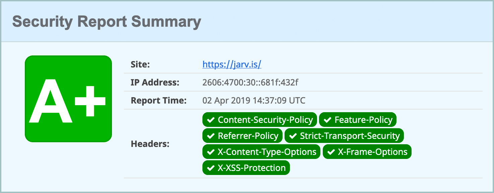
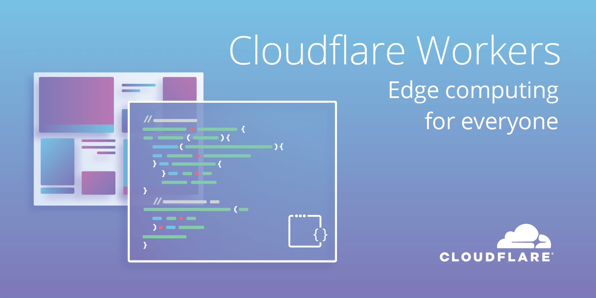

In 2019, it's becoming more and more important to harden websites via HTTP response headers, which all modern browsers parse and enforce. Multiple standards have been introduced over the past few years to protect users from various attack vectors, including `Content-Security-Policy` for injection protection, `Strict-Transport-Security` for HTTPS enforcement, `X-XSS-Protection` for cross-site scripting prevention, `X-Content-Type-Options` to enforce correct MIME types, `Referrer-Policy` to limit information sent with external links, [and many, many more](https://www.netsparker.com/whitepaper-http-security-headers/).

[Cloudflare Workers](https://www.cloudflare.com/products/cloudflare-workers/) are a great feature of [Cloudflare](https://www.cloudflare.com/) that allows you to modify responses on-the-fly between your origin server and the user, similar to [AWS Lambda](https://aws.amazon.com/lambda/) (but much simpler). We'll use a Worker to add the headers.



Workers can be enabled for $5/month via the [Cloudflare Dashboard](https://dash.cloudflare.com/). (It's worth noting, once enabled, Workers can be used on *any zone* on your account, not just one website!).

If you run your own server, these can be added by way of your Apache or nginx configuration. But if you're using a shiny static site host like [GitHub Pages](https://pages.github.com/), [Amazon S3](https://aws.amazon.com/s3/), [Surge](https://surge.sh/), etc. it may be difficult or impossible to do so.

The following script can be added as a Worker and customized to your needs. Some can be extremely picky with syntax, so be sure to [read the documentation](https://www.netsparker.com/whitepaper-http-security-headers/) carefully. You can fiddle with it in [the playground](https://cloudflareworkers.com/), too. Simply modify the current headers to your needs, or add new ones to the `newHeaders` or `removeHeaders` arrays. 

```js
let addHeaders = {
  "Content-Security-Policy": "default-src 'self'; upgrade-insecure-requests",
  "Strict-Transport-Security": "max-age=1000",
  "X-XSS-Protection": "1; mode=block",
  "X-Frame-Options": "SAMEORIGIN",
  "X-Content-Type-Options": "nosniff",
  "Referrer-Policy": "same-origin"
}

let removeHeaders = [
  "Server",
  "Public-Key-Pins",
  "X-Powered-By",
  "X-AspNet-Version"
]

addEventListener("fetch", event => {
  event.respondWith(fetchAndApply(event.request))
})

async function fetchAndApply(request) {
  // Fetch the original page from the origin
  let response = await fetch(request)

  // Make response headers mutable
  response = new Response(response.body, response)

  // Set each header in addHeaders
  Object.keys(addHeaders).map(function(name, index) {
    response.headers.set(name, addHeaders[name])
  })

  // Delete each header in removeHeaders
  removeHeaders.forEach(function(name){
    response.headers.delete(name)
  })

  // Return the new mutated page
  return response
}
```


Once you're done, you can analyze your website's headers and get a letter grade with [Scott Helme](https://scotthelme.co.uk/)'s awesome [Security Headers](https://securityheaders.com/) tool. His free [Report-URI](https://report-uri.com/) service is another great companion tool to monitor these headers and report infractions your users run into in the wild.

You can view my website's [full Worker script here](https://git.jarv.is/jake/jarv.is/blob/master/worker.js) and check out [the resulting A+ grade](https://securityheaders.com/?q=https%3A%2F%2Fjarv.is%2F)!
